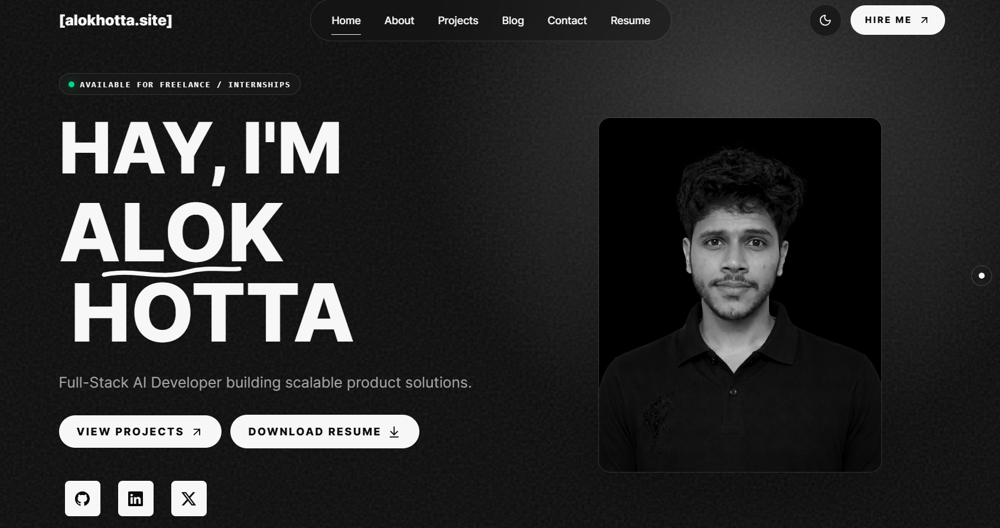

# Portfolio


Live site: [www.alokhotta.site](https://www.alokhotta.site)


A full-stack developer portfolio for showcasing projects, writing, experience,
skills, and contact details. The frontend is built with React, TypeScript, Vite,
Tailwind CSS, and Framer Motion. The backend serves dynamic project and blog
content with Express and MongoDB.


## Features

- Responsive portfolio homepage with hero, about, skills, projects, experience,
  blog preview, and contact sections.
- Dedicated projects page with tech-stack filtering and expandable filter chips.
- Blog listing page with search, sorting, tag filters, and topic counts.
- Blog detail page with Markdown content, readable heading hierarchy, code copy
  buttons, and a floating table of contents.
- Backend-seeded content for projects and blogs.
- Static asset serving for project and blog images from `backend/assets`.

## Tech Stack

- React
- TypeScript
- Vite
- Tailwind CSS
- Framer Motion
- Express
- MongoDB
- Mongoose

## Project Structure

```txt
backend/
  assets/
    blog/
    project/
  src/
    controllers/
    models/
    routes/
    scripts/seed.ts

frontend/
  src/
    components/
    data/
    lib/
    pages/
    styles/
```

## Content Workflow

Projects and blog posts are maintained in `backend/src/scripts/seed.ts`.

For project images, place files in:

```txt
backend/assets/project
```

Then reference them with:

```ts
projectImage('file-name.png')
```

For blog images, place files in:

```txt
backend/assets/blog
```

Then reference them with:

```ts
blogImage('file-name.png')
```

## Blog Writing Format

Each blog post starts with one Markdown `# Title`. The frontend strips this from
the article body because the page already renders the title.

Use this structure for readable posts:

```md
# Post Title

Opening paragraph.

## Main Section

- First point.
- Second point.
- Third point.

### Subheading

More focused explanation.

## Closing Section

Final takeaway.
```

## Local Development

Install dependencies in both apps:

```bash
cd backend
npm install

cd ../frontend
npm install
```

Run the backend:

```bash
cd backend
npm run dev
```

Run the frontend:

```bash
cd frontend
npm run dev
```

Seed content:

```bash
cd backend
npm run seed
```

## Environment

Create `backend/.env` from `backend/.env.example` and set `MONGO_URI`.

The frontend uses `VITE_API_URL` when provided. If it is not set, it defaults to:

```txt
http://localhost:5000/api
```
