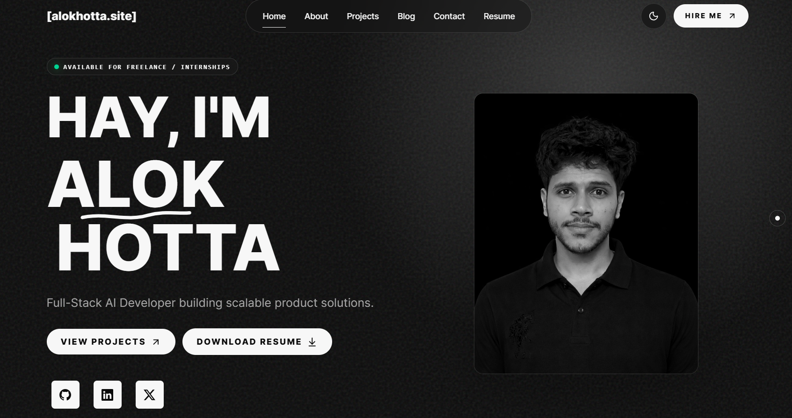

# Alok Hotta — Full-Stack AI Developer Portfolio



> **Live Website:** [www.alokhotta.site](https://www.alokhotta.site)  
> **Backend API:** [portfolio-backend-kappa-plum.vercel.app](https://portfolio-backend-kappa-plum.vercel.app)

A modern, high-performance, full-stack developer portfolio and technical blog built for **Alok Hotta** (Full-Stack & AI Engineer). Designed with a rich aesthetic, dark mode styling, smooth micro-interactions, responsive navigation, dynamic markdown article rendering, in-browser PDF resume viewer, automated contact email notifications, and dynamic Open Graph metadata generation for social sharing.

---

## 🌟 Key Features

- **⚡ Interactive Home & Hero Section:** Dynamic headline animation, status badge, tech stack highlights, quick stats counter, and call-to-action buttons.
- **🎨 Rich Design & Smooth Micro-Interactions:** 
  - Smooth wheel scrolling via `@studio-freight/lenis`.
  - Custom animated cursor effect with toggle capability (`CustomCursor`).
  - Top reading/page scroll progress bar (`ScrollProgressBar`).
  - Fluid entrance animations using `framer-motion` and `AnimatePresence`.
  - Accessible design with "Skip to main content" links and focus outlines.
- **💻 Projects Showcase Page:** 
  - Tech-stack and category filtering.
  - Interactive project cards with live site previews, GitHub repository links, and featured project badges.
- **📝 Technical Blog & Article Reader:**
  - Search engine with real-time keyword filtering, tag categorization, reading time calculation, and topic counters.
  - Markdown article rendering supporting syntax highlighting (`rehype-highlight`), autogenerated Table of Contents (TOC), heading slug anchors (`rehype-slug`), and GitHub Flavored Markdown (`remark-gfm`).
  - Code snippet quick-copy buttons and dynamic cover art generator (`BlogCoverArt`).
- **📄 Interactive In-Browser Resume Viewer:**
  - PDF document reader powered by `react-pdf`.
  - Page navigation, zoom controls, full-screen toggle, and direct PDF download options.
- **✉️ Resilient Contact System:**
  - Validated contact form using `react-hook-form` + `zod`.
  - Backend API (`POST /api/contact`) protected by IP rate limiting (max 20 requests / 15 minutes).
  - Automated HTML email notifications delivered directly via `Nodemailer`.
  - **DB Fallback Resilience:** Functions even if MongoDB is offline by delivering emails directly.
- **🔍 Dynamic Open Graph (OG) & Social Sharing SEO:**
  - Vercel serverless function (`frontend/api/og.js`) that intercepts requests for blog articles and dynamically injects article-specific title, description, and cover image meta tags into HTML for social media preview cards (LinkedIn, Twitter/X, Discord, WhatsApp).
  - Custom client-side SEO management hook (`useSEO.ts`).

---

## 🛠️ Tech Stack

### **Frontend**
- **Core:** React 19, TypeScript 5, Vite 8
- **Styling:** Tailwind CSS v4 (`@tailwindcss/vite`), Radix UI primitives, Lucide Icons, React Icons
- **Animations & Motion:** Framer Motion 12, Lenis Smooth Scroll (`@studio-freight/lenis`), React Type Animation
- **Routing & State:** React Router DOM v7
- **Markdown & Content:** React Markdown v10, Rehype Highlight, Rehype Slug, Remark GFM
- **Document Viewing:** React PDF (`react-pdf`)
- **Forms & Toast:** React Hook Form, Zod, React Hot Toast
- **SEO & Serverless:** Custom OpenGraph HTML serverless handler (`frontend/api/og.js`)

### **Backend**
- **Runtime & Framework:** Node.js, Express 5, TypeScript 5
- **Database & ODM:** MongoDB, Mongoose 9
- **Email Delivery:** Nodemailer
- **Security & Utilities:** Helmet, CORS, Express Rate Limit, TSX

---

## 📁 Project Structure

```txt
portfolio/
├── backend/
│   ├── api/
│   │   └── index.ts               # Vercel serverless Express wrapper entry point
│   ├── assets/                    # Static media files (blog & project images)
│   │   ├── blog/
│   │   └── project/
│   ├── src/
│   │   ├── config/                # Database connection & health utilities
│   │   ├── controllers/           # Business logic (blogs, projects, contact)
│   │   ├── middleware/            # Global error handling middleware
│   │   ├── models/                # Mongoose schemas (Blog, Project, Message)
│   │   ├── routes/                # Express API routes (/api/blogs, /api/projects, /api/contact)
│   │   ├── scripts/               # Seed script (`seed.ts`)
│   │   └── index.ts               # Express server entry point
│   ├── package.json
│   ├── tsconfig.json
│   └── vercel.json                # Vercel backend serverless configuration
│
├── frontend/
│   ├── api/
│   │   └── og.js                  # Dynamic Open Graph meta-tag serverless function
│   ├── public/                    # Static assets (Resume PDF, favicon, robots.txt)
│   ├── src/
│   │   ├── components/
│   │   │   ├── layout/            # Navbar, Footer, PageTransition
│   │   │   ├── sections/          # Hero, About, Skills, Projects, Experience, BlogPreview, Contact
│   │   │   └── ui/                # CustomCursor, ScrollProgressBar, LoadingScreen, BlogCoverArt
│   │   ├── data/                  # Static fallbacks (about, experience, skills)
│   │   ├── hooks/                 # Custom React hooks (useSEO)
│   │   ├── lib/                   # API clients (axios) & helper functions
│   │   ├── pages/                 # Home, Blog, BlogPost, Projects, Resume, NotFound
│   │   ├── styles/                # CSS utilities & typography setup
│   │   └── types/                 # TypeScript interfaces and types
│   ├── package.json
│   ├── tailwind.config.ts
│   ├── vite.config.ts
│   └── vercel.json                # Vercel frontend routing & rewrite rules
│
└── README.md                      # Project documentation
```

---

## 🔌 API Endpoints

| Method | Endpoint | Description |
| :--- | :--- | :--- |
| `GET` | `/` | API status & endpoint directory |
| `GET` | `/health` | Server health status & MongoDB connection state |
| `GET` | `/api/blogs` | Get all blog posts (supports optional `?tag=` filter) |
| `GET` | `/api/blogs/:slug` | Get specific blog post by slug |
| `GET` | `/api/projects` | Get all projects (supports optional `?category=` filter) |
| `GET` | `/api/projects/:slug` | Get specific project details by slug |
| `POST` | `/api/contact` | Submit contact message (Rate-limited: 20 req / 15 min) |
| `GET` | `/assets/*` | Serve static blog and project images |

---

## ⚙️ Environment Configuration

### **Backend Environment Variables (`backend/.env`)**

Create `backend/.env` using `backend/.env.example` as reference:

```env
PORT=5000
NODE_ENV=development
MONGO_URI=mongodb+srv://<user>:<password>@cluster.mongodb.net/portfolio?retryWrites=true&w=majority
CLIENT_URL=http://localhost:5173,https://www.alokhotta.site

# Nodemailer Contact Form Configuration
ADMIN_EMAIL=your@email.com
SMTP_HOST=smtp.gmail.com
SMTP_PORT=587
SMTP_USER=your-email@gmail.com
SMTP_PASS=your-app-password
```

### **Frontend Environment Variables (`frontend/.env`)**

```env
VITE_API_URL=http://localhost:5000/api
```

*For production deployment, set `VITE_API_URL` to your live API endpoint (e.g. `https://portfolio-backend-kappa-plum.vercel.app/api`).*

---

## 🚀 Local Development Setup

### **1. Clone the repository**
```bash
git clone https://github.com/iamalok123/portfolio.git
cd portfolio
```

### **2. Setup & Run Backend**
```bash
cd backend
npm install

# Create environment file
cp .env.example .env
# Update .env with your MONGO_URI and SMTP details

# Seed database with initial projects and blog posts
npm run seed

# Start development server
npm run dev
```
*Backend runs locally at `http://localhost:5000`*

### **3. Setup & Run Frontend**
```bash
# In a new terminal window:
cd frontend
npm install

# Start Vite development server
npm run dev
```
*Frontend runs locally at `http://localhost:5173`*

---

## 🖋️ Content Management & Writing Format

### **Database Seeding**
Projects and blog posts are managed via `backend/src/scripts/seed.ts`. To re-seed or update initial data:
```bash
cd backend
npm run seed
```

### **Media Assets**
- Place project screenshots in `backend/assets/project/`
- Place blog article images in `backend/assets/blog/`

### **Blog Post Writing Guidelines**
Each blog post body is stored in Markdown format. The system automatically extracts reading time, table of contents headers (`##`, `###`), and code blocks.

Example structure:
```markdown
# Post Title

Introductory paragraph summarizing the core topic.

## Key Section

- Point 1
- Point 2

```ts
// Code snippet with syntax highlighting support
const greeting = "Hello World";
```

## Summary & Key Takeaways

Final conclusions and takeaways.
```

---

## 🌐 Deployment (Vercel)

Both frontend and backend are configured for seamless deployment on Vercel:

- **Backend:** Uses `backend/vercel.json` to wrap the Express application into a Serverless Function (`api/index.ts`) while serving static assets from `backend/assets`.
- **Frontend:** Uses `frontend/vercel.json` for single-page application SPA routing and rewrites `/blog/:slug` requests to `api/og.js` for serverless Open Graph HTML meta tag injection.

---

## 📜 License

This project is open source and available under the [MIT License](LICENSE).

